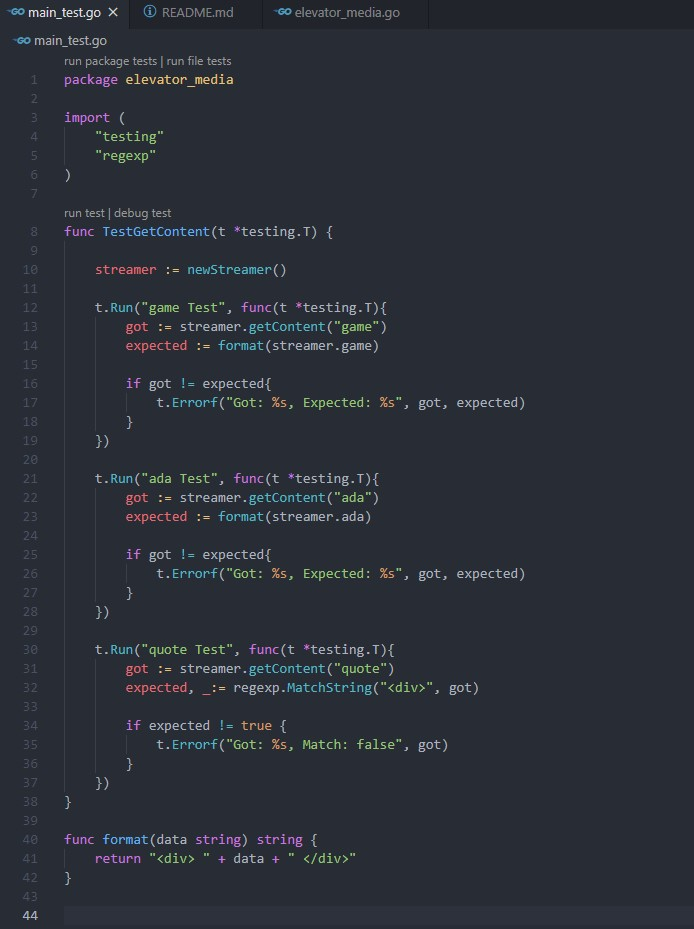

 
# TDD with Go 

As a bonus, we had to practice TDD by implementing the ElevatorMedia logic in other languages. TDD with Go is really intuitive and simple to understand. 

Go has a free library of testing features called "testing", and there are also many others that resemble RSpec.

- The first step was to create my test file
- The second test was to create my ElevatorMedia

Here we have the test file. It contains:
- elevator_media package
- testing library
- regexp libraty

Here we have the elevator_media package with it's Streamer struct. The getContent method will return different content based on the argument we give it. 

## All tests pass
